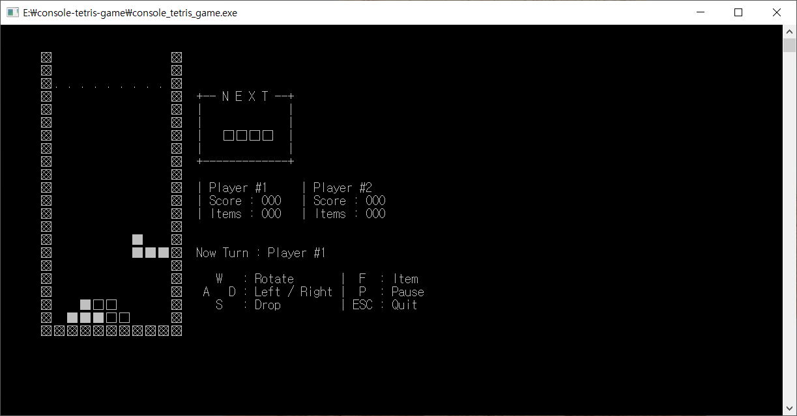

# 콘솔 테트리스 게임

![language-c][language-c]
 
![participants-solo][participants-solo]
 
[![institution-korea-university][korea-university-image]][korea-university-cs-url]
![course-computer-programming-i][course-cose101]
![grade-a+][grade-a+]

> 콘솔에서 두 사람이 아이템을 사용하며 번갈아서 플레이하는 테트리스 게임입니다.

### 스크린샷

### 개발 기간

2017년 상반기

### 라이선스 및 공동체 수정

이곳은 개인 프로젝트 백업을 목적으로 하는 저장소입니다.

  * 모든 제3자 사용을 허가하지 않습니다.
  * 모든 제3자 수정을 승인하지 않습니다.
    * 깃허브 Pull Request를 받지 않습니다.

<!-- Image definitions -->
[korea-university-image]: https://img.shields.io/badge/Institution-Korea%20University-red
[korea-university-cs-url]: http://cs.korea.ac.kr
[course-cose101]: https://img.shields.io/badge/Course-Computer%20Programming%20I-brightgreen
[language-c]: https://img.shields.io/badge/Language-C-orange
[grade-a+]: https://img.shields.io/badge/Grade-A%2B-yellow
[participants-solo]: https://img.shields.io/badge/Participants-Solo%20Project-7aa3cc
